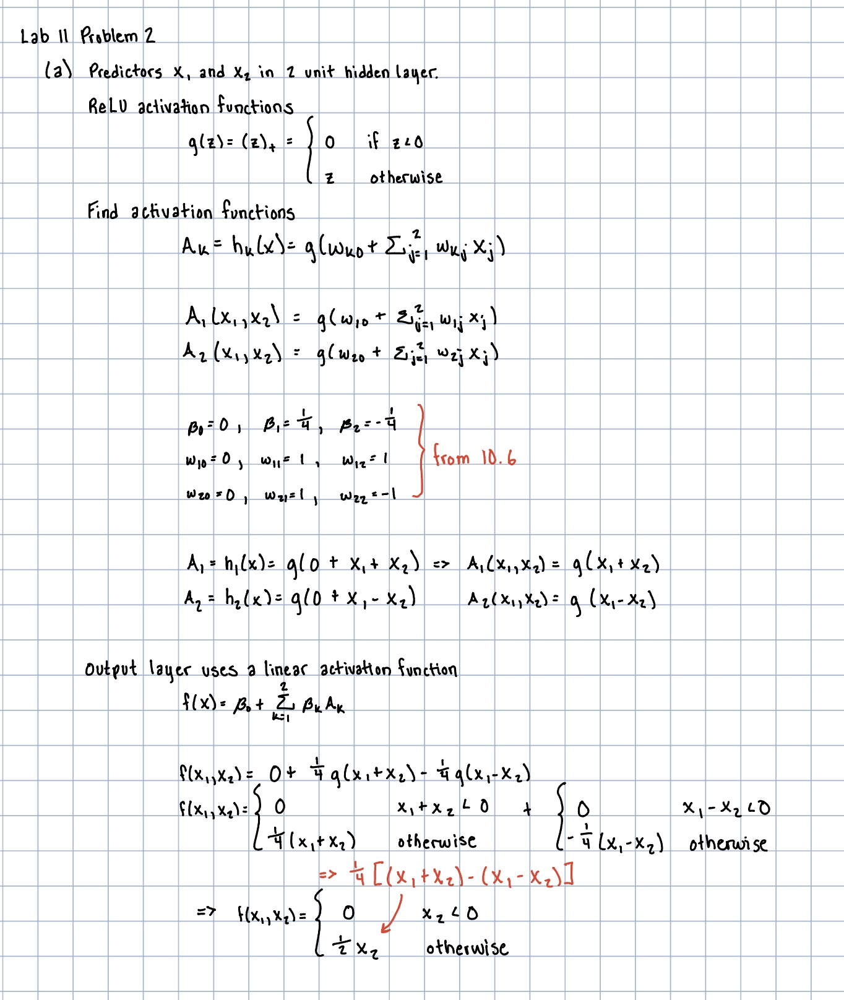

# Instructions

The purpose of this lab is to introduce neural networks using the `keras` package. In lecture we saw a single-hidden-layer model, but more complicated neural networks (such as CNNs, deep learning, etc.) are usually custom-built using the keras interface.

```{r setup, include=FALSE}
knitr::opts_chunk$set(echo = TRUE)
```

```{r libraries and data, message = FALSE, warning = FALSE}
library(ISLR2)
library(dplyr)
library(ggplot2)
library(keras)
```

This lab assignment is worth a total of **10 points**.

# Problem 1: Book Code

## Part a (Code: 3 pts)

Get `keras` installed on your computer. Then run the example code in Labs 10.9.1, 10.9.2, 10.9.3, and 10.9.4. Notes:

* The first time you try to set up keras, you will have to run `install_keras()` to actually install keras, Tensorflow, and their dependencies. If you do not have Python with Anaconda (or Miniconda) installed already on your device, you may want to follow the instructions in the error messages. If you cannot interpret an error message, please call me over.
* You probably cannot run GPU-based `keras` on your machine and will get a bunch of error messages when you first try to do anything with it. I was able to run the whole lab with CPU-based `keras`. 
* In Lab 10.9.2, `predict_classes()` is deprecated and may throw an error. If you cannot figure out how to interpret the error message to get around it, please call me over.
* For Lab 10.9.4, I have found that if I put the `book_images` folder (unzipped) as a subfolder of the directory the lab is in, then everything will work as intended. If you get a "Permission denied" error, then you probably need to change the `img_dir` or move the folder around.
* If all else fails, try running the `torch` version of the lab, which can be found at <https://www.statlearning.com/resources-second-edition>.

```{r}
Gitters <- na.omit (Hitters)
n <- nrow (Gitters)
set.seed (13)
ntest <- trunc (n / 3)
testid <- sample (1:n, ntest)
```

```{r}
lfit <- lm(Salary ~ ., data = Gitters[-testid , ])
lpred <- predict(lfit , Gitters[testid , ])
with(Gitters[testid, ], mean(abs(lpred - Salary)))
```

```{r}
x <- scale ( model.matrix (Salary ~ . - 1, data = Gitters))
y <- Gitters$Salary
```

```{r}
library(glmnet)
cvfit <- cv.glmnet(x[-testid , ], y[-testid], type.measure = "mae")
cpred <- predict (cvfit , x[testid , ], s = "lambda.min")
mean ( abs (y[testid] - cpred))
```


```{r}
modnn <- keras_model_sequential () %>%
  layer_dense (units = 50, activation = "relu",input_shape = ncol (x)) %>%
  layer_dropout (rate = 0.4) %>%
  layer_dense (units = 1)
```

```{r}
modnn %>% compile (loss = "mse",
  optimizer = optimizer_rmsprop(),
  metrics = list ("mean_absolute_error"))
```

```{r}
history <- modnn %>% fit (
x[-testid , ], y[-testid], epochs = 1500, batch_size = 32,
validation_data = list (x[testid , ], y[testid]))
```

```{r}
plot(history)
```

```{r}
npred <- predict(modnn , x[testid , ])
mean(abs(y[testid] - npred))
```

______________________________________________________

```{r}
mnist <- dataset_mnist()
x_train <- mnist$train$x
g_train <- mnist$train$y
x_test <- mnist$test$x
g_test <- mnist$test$y
dim (x_train)
dim (x_test)
```

```{r}
x_train <- array_reshape (x_train , c( nrow (x_train), 784))
x_test <- array_reshape (x_test , c( nrow (x_test), 784))
y_train <- to_categorical (g_train , 10)
y_test <- to_categorical (g_test , 10)
```

```{r}
x_train <- x_train / 255
x_test <- x_test / 255
```

```{r}
modelnn <- keras_model_sequential()
modelnn %>%
  layer_dense (units = 256, activation = "relu", input_shape = c (784)) %>%
  layer_dropout (rate = 0.4) %>%
  layer_dense (units = 128, activation = "relu") %>%
  layer_dropout (rate = 0.3) %>%
  layer_dense (units = 10, activation = "softmax")
```

```{r}
summary(modelnn)
```

```{r}
modelnn %>% compile (loss = "categorical_crossentropy", optimizer = optimizer_rmsprop(), metrics = c("accuracy"))
```

```{r}
system.time(
  history <- modelnn %>%
  fit (x_train , y_train , epochs = 30, batch_size = 128, validation_split = 0.2)
  )
plot(history, smooth = FALSE)
```

```{r}
accuracy <- function(pred,truth) (
  mean(drop(pred) == drop(truth))
  )
modelnn %>% 
  predict(x_test) %>% k_argmax() %>% 
  as.numeric() %>%
  accuracy(g_test)
```

```{r}
modellr <- keras_model_sequential () %>%
  layer_dense (input_shape = 784, units = 10, activation = "softmax")
summary (modellr)
```

```{r}
modellr %>% compile(loss = "categorical_crossentropy", optimizer = optimizer_rmsprop(), metrics = c("accuracy"))
modellr %>% fit (x_train , y_train , epochs = 30, batch_size = 128, validation_split = 0.2)
modellr %>% 
  predict(x_test) %>% k_argmax() %>% 
  as.numeric() %>%
  accuracy(g_test)
```

```{r}
cifar100 <- dataset_cifar100()
names (cifar100)
x_train <- cifar100$train$x
g_train <- cifar100$train$y
x_test <- cifar100$test$x
g_test <- cifar100$test$y
dim (x_train)
range (x_train[1,,, 1])
```

```{r}
x_train <- x_train / 255
x_test <- x_test / 255
y_train <- to_categorical (g_train , 100)
dim (y_train)
```

```{r}
library(jpeg)
par (mar = c(0, 0, 0, 0), mfrow = c(5, 5))
index <- sample ( seq(50000), 25)
for (i in index) plot (as.raster (x_train[i,,, ]))
```

```{r}
model <- keras_model_sequential () %>%
  layer_conv_2d(filters = 32, kernel_size = c(3, 3), padding = "same", activation = "relu", input_shape = c(32, 32, 3)) %>%
  layer_max_pooling_2d(pool_size = c(2, 2)) %>%
  layer_conv_2d(filters = 64, kernel_size = c(3, 3),padding = "same", activation = "relu") %>%
  layer_max_pooling_2d(pool_size = c(2, 2)) %>%
  layer_conv_2d(filters = 128, kernel_size = c(3, 3),padding = "same", activation = "relu") %>%
  layer_max_pooling_2d(pool_size = c(2, 2)) %>%
  layer_conv_2d(filters = 256, kernel_size = c(3, 3),padding = "same", activation = "relu") %>%
  layer_max_pooling_2d(pool_size = c(2, 2)) %>%
  layer_flatten() %>%
  layer_dropout(rate = 0.5) %>%
  layer_dense (units = 512, activation = "relu") %>%
  layer_dense (units = 100, activation = "softmax")
summary (model)
```

```{r}
model %>% compile (loss = "categorical_crossentropy", optimizer = optimizer_rmsprop(), metrics = c("accuracy"))
history <- model %>% fit (x_train , y_train , epochs = 30, batch_size = 128, validation_split = 0.2)
model %>% predict(x_test) %>% k_argmax() %>% 
  as.numeric() %>%
  accuracy(g_test)
```


```{r}
img_dir <- "book_images"
image_names <- list.files(img_dir)
num_images <- length(image_names)
x <- array(dim = c(num_images , 224, 224, 3))
for (i in 1:num_images) {
  img_path <- paste (img_dir , image_names[i], sep = "/")
  img <- image_load (img_path, target_size = c(224, 224))
  x[i,,, ] <- image_to_array(img)
}
x <- imagenet_preprocess_input(x)
```

```{r}
model <- application_resnet50(weights = "imagenet")
summary(model)
```

```{r}
pred6 <- model %>% predict(x) %>%
  imagenet_decode_predictions(top = 3)
names(pred6) <- image_names
print(pred6)
```


## Part b (Explanation: 1 pt)

In Lab 10.9.2, it is claimed that their neural network with zero hidden layers is equivalent to a multinomial logistic regression model. Explain why this is the case.

This is the case because neural networks output linear combinations of the inputs with coefficient estimates that are computed as class probabilities using the softmax activation function.

## Part c (Code and/or Explanation: 1 pt)

Using the ideas in part (b), how would you revise the code creating `modellr` to perform *linear* regression instead? (HINT: look up the documentation for `layer_dense`)

If we wanted to perform linear regression we would set activation = "linear" or not include an argument for activation and it will default to the linear function.

## Part d (Explanation: 1 pt)

Briefly explain what the `to_categorical` function does, and the types of problems in which it would be useful.

The to_cateogrical function converts vectors of integers that represent classes into a matrix with rows that use 0 1 coding (binary) to indicate the classes in the vector. This would be useful when you're modeling a qualitative response that is represented by values but those values don't actually indicate the order of the data.

# Problem 2: Understanding the Math

## Part a (Computation and Explanation: 2 pts)

Consider two predictors, $x_1$ and $x_2$, feeding into a two-unit hidden layer. Suppose that the hidden layer uses ReLU activation functions with $w_{kj}$ given in Equation (10.6) of the book and the output layer uses a linear activation function with $\beta_j$ given in equation (10.6).

Find the activation functions $A_1(x_1, x_2)$ and $A_2(x_1, x_2)$. Then, find $f(x_1, x_2)$ explicitly in terms of $x_1$ and $x_2$. Note: $f(x_1, x_2)$ should be a piecewise function.

```{r} 
 
```

## Part b (Computation and Explanation: 2 pts)

Consider the following 5x5 matrix:

```{r A 5x5}
A <- matrix(c(5, 5, 5, 5, 5,
              0, 4, 4, 4, 4,
              0, 0, 3, 3, 3,
              0, 0, 0, 2, 2,
              0, 0, 0, 0, 1),
            nrow = 5, byrow = T
            )
print(A)
```

Without running anything in R, find the output of convolving A with the 2x2 convolution filter

```{r conv}
conv <- matrix(c(1, 0, 0, 1), nrow = 2)
print(conv)
```

followed by a $2 \times 2$ max pool.

To find the output of convolving A with the 2x2 convolution filter, we apply the filter to every 2 × 2 submatrix of the original 5x5 matrix. The result will be a 4x4 matrix. We get the entries as follows:

For the first submatrix, 5(1) + 5(0) + 0(0) + 4(1) = 9 which is our first entry in the convolved matrix. Similary, the (1,2) entry is 5(1) + 5(0) + 4(0) + 4(1) = 9. We repeat this for every 2x2 submatrix, giving us the final matrix below.
```{r}
conv_A <- matrix(c(9, 9, 9, 9,
              0, 7, 7, 7,
              0, 0, 5, 5,
              0, 0, 0, 3),
            nrow = 4, byrow = T
            )
print(conv_A)
```

Using this matrix, we perform max pooling by choosing the maximum value in each non-overlapping 2x2 submatrix. For example, the first 2x2 submatrix 
```{r}
example <- matrix(c(9, 0, 9, 7), nrow = 2)
print(example)
```
has maximum value 9 which is the first entry in our final matrix. 

Our final matrix is below.
```{r}
final_A <- matrix(c(9, 0, 9, 5), nrow = 2)
print(final_A)
```